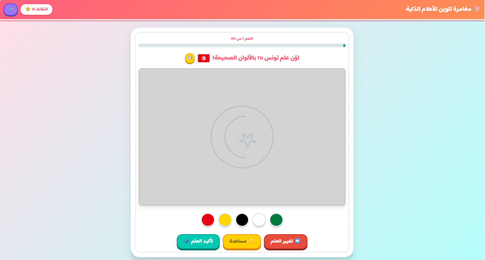

# 🎨 تحدي تلوين الأعلام السحري (Flag Painter Kids)

Une application web interactive, ludique et éducative permettant d'apprendre et de colorier les drapeaux du monde entier. Conçue avec une interface entièrement en arabe, elle est idéale pour les enfants, les étudiants et tous les passionnés de géographie !



## ✨ Fonctionnalités Principales

- **🌍 Vaste collection de drapeaux :** Plus de 70 drapeaux recréés fidèlement en SVG interactif (pays arabes, européens, américains, asiatiques, etc.).
- **🎨 Télémétrie de couleurs intelligente :** Une palette de couleurs mélangée aléatoirement est générée pour chaque drapeau, obligeant le joueur à réfléchir aux bonnes couleurs.
- **🔊 Synthèse vocale (TTS) :** Un bouton dédié permet d'écouter la prononciation du nom du pays en arabe grâce à la *Web Speech API*.
- **🎵 Effets sonores dynamiques :** Des retours sonores (clic, succès, erreur) sont générés en temps réel via la *Web Audio API* (sans nécessiter de fichiers audio externes).
- **💡 Système d'indices visuels :** En cas de difficulté, le joueur peut afficher le vrai drapeau pendant 4 secondes.
- **🎉 Animations de récompense :** Une pluie de confettis célèbre chaque réussite pour encourager l'apprentissage.
- **📚 Enrichissement éducatif & Gamification :** Un système d'évaluation par étoiles (1 à 3) avec l'affichage de la capitale et d'une anecdote ("Le saviez-vous ?") pour chaque pays réussi.
- **🏆 Système de score et progression :** Suivi en temps réel de l'avancement (barre de progression) et calcul du score.
- **📱 Entièrement Responsive & Plein écran :** Jouable sur ordinateur, tablette et smartphone, avec un mode plein écran natif pour une immersion totale.

## 🚀 Technologies Utilisées

Ce projet est construit de manière native sans frameworks lourds, ce qui le rend ultra-léger et rapide :

- **HTML5** : Sémantique et structure, intégration directe des `SVG`.
- **CSS3** : Variables CSS, Flexbox/Grid, animations CSS fluides, conception responsive.
- **JavaScript (ES6+)** : 
  - Manipulation du DOM.
  - `AudioContext` pour la génération des fréquences sonores.
  - `SpeechSynthesisUtterance` pour la lecture vocale.
  - Logique de validation algorithmique des couleurs Hexadécimales.

## 📂 Structure du Projet

```text
📦 flag-painter-kids
 ┣ 📜 coloriage-drapeaux.html  # Fichier principal contenant la structure, les données et la logique (ou séparé)
 ┣ 📜 data.js                  # Base de données externe contenant les objets drapeaux (noms, codes, palettes, SVGs)
 ┣ 📜 style.css                # Feuille de style principale (UI, layout, animations)
 ┗ 📜 README.md                # Ce fichier
```

## 🛠️ Installation et Utilisation

Aucune installation serveur ou base de données n'est requise. C'est une application front-end pure ("Vanilla").

1. **Cloner le dépôt :**
   ```bash
   git clone https://github.com/ayoubbenkhiroun/flag-painter-kids.git
   ```
2. **Accéder au dossier :**
   ```bash
   cd flag-painter-kids
   ```
3. **Lancer le jeu :**
   Double-cliquez simplement sur le fichier `coloriage-drapeaux.html` pour l'ouvrir dans votre navigateur web préféré (Chrome, Firefox, Edge, Safari recommandés pour une compatibilité parfaite avec la synthèse vocale).

## 🎮 Comment Jouer ?

1. Regardez le nom du pays affiché en haut. (Utilisez le bouton 🔊 pour l'écouter).
2. Observez le drapeau vide (en gris clair).
3. Sélectionnez une couleur dans la palette en bas de l'écran.
4. Cliquez sur les différentes zones du drapeau pour les peindre.
5. Le jeu vérifie automatiquement chaque action. Si toutes les couleurs sont au bon endroit, vous gagnez des points et passez au niveau suivant !
6. Si vous êtes bloqué, cliquez sur le bouton **"💡 مساعدة"** (Aide).

## 🤝 Contribution

Les contributions sont les bienvenues ! Que ce soit pour ajouter de nouveaux drapeaux (au format SVG), améliorer le design ou optimiser le code :

1. Forkez le projet.
2. Créez une branche pour votre fonctionnalité (`git checkout -b feature/AjoutDrapeaux`).
3. Commitez vos changements (`git commit -m 'Ajout de 5 nouveaux drapeaux'`).
4. Poussez vers la branche (`git push origin feature/AjoutDrapeaux`).
5. Ouvrez une **Pull Request**.

## 📝 Recommandations de développement futur

- Ajouter un écran d'accueil (Menu principal) et un écran de fin.
- Sauvegarder le meilleur score dans le `localStorage` du navigateur.
- Ajouter des catégories (Par continent, niveau de difficulté).
- **Transformer en PWA (Progressive Web App) :** Ajouter un `manifest.json` et un *Service Worker* pour permettre l'installation sur mobile et le jeu hors-ligne.
- **Accessibilité (Mode Daltonien) :** Ajouter des infobulles textuelles ou des motifs sur les couleurs de la palette.

## 📄 Licence

Ce projet est sous licence MIT - voir le fichier LICENSE.md pour plus de détails.

---

*Développé avec ❤️ pour l'apprentissage.*